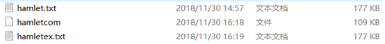

# 设计思路：

​		先根据用户的输入文件统计字符的词频，然后根据词频建立哈夫曼树，进而生成哈夫曼编码储存起来。然后再一次扫描输入文件，根据文件中的信息及哈夫曼编码生成压缩后的文件，在压缩后的文件开头保存生成哈夫曼树的必要信息。

​		解压文件时，先根据文件开头的信息生成哈夫曼树及哈夫曼编码，然后根据压缩文件信息解压文件。

```c++
//压缩函数
void ComAndEx::Compress()
{
	string filename = ScanCharacter();//扫描源文件种字符的种类及个数，返回源文件的文件名并用string类型变量保存
	if (filename == "NULL")return;
	BuildHuffmanTree();//构造哈夫曼树
	CreateHuffmanCode(TreeRoot); //生成哈夫曼编码
	cout << "请输入压缩后的文件名：" << endl;
	string outname;
	cin >> outname;
	ofstream out(outname, ios::binary);
	if (!out)
	{
		cout << "操作失败" << endl;
		return;
	}
	out.write((char*)&Hnodenum, sizeof(HuffmanCode.size()));
	for (auto i : HuffmanCode)//依次输入字符及字符的频度
	{
		out.write((char*)&i.name, sizeof(unsigned char));
		out.write((char*)&i.weight, sizeof(unsigned int));
	}
	ifstream in(filename, ios::binary);//根据源文件生成压缩文件
	if (!in)
	{
		cout << "打开源文件失败" << endl;
		return;
	}
	unsigned char temp_char = 0;//用8位的无符号变量作为读写字符的单元
	string unit;//存储哈夫曼编码，编码的个数大于等于八位就和char_temp进行|操作
	while (true)
	{
		temp_char = in.get();//在原文件中读取一个字符
		if (in.eof())break;//判断是否到达文件的末尾
		for (int i = 0; i < Hnodenum; i++)//在存取哈夫曼编码的数组中找到该字符对应的编码并将编码存储到unit中
		{
			if (temp_char == HuffmanCode[i].name)
			{
				unit += HuffmanCode[i].code;
			}
		}
		while (unit.size() >= 8)//如果unit中存储的哈夫曼编码的位数大于等于8，就将前八位通过位操作写入char_temp中
		{
			temp_char = 0;
			for (int i = 0; i < 8; i++)
			{
				temp_char = temp_char << 1;
				if (unit[i] == '1')
					temp_char = temp_char | 1;
			}
			auto p = unit.begin();
			unit.erase(p, p+8);//清空unit中的前八位编码
			out.write((char*)&temp_char, sizeof(unsigned char));//将载有哈夫曼编码信息的字符写入到压缩文件中去
		}
	}
	if (unit.length() > 0)//处理最后不足八位的哈夫曼编码
	{
		temp_char = 0;
		for (decltype(unit.length()) i = 0; i < unit.length(); ++i)
		{
			temp_char = temp_char << 1;
			if (unit[i] == '1')
				temp_char = temp_char | 1;
		}
		for (decltype(unit.length()) i = 0; i < (8 - unit.length()); ++i)//将编码移到到高位
			temp_char = temp_char << 1;
		out.write((char*)&temp_char, sizeof(unsigned char));
	}
	in.close();
	out.close();
	//文件压缩完成，重新初始化自身的成员变量
	DestoryTree(TreeRoot);
	HuffmanCode.resize(0);
	Hnodenum = 0;
	tempcode = "\0";
}
//建立哈夫曼树
void ComAndEx::BuildHuffmanTree()
{
	while (pque.size() > 1)
	{
		Hnode *min = pque.top(); pque.pop();//取出权重最小结点
		Hnode *secmin = pque.top(); pque.pop();//取出权重次小结点
		Hnode *newnode = new Hnode(0, min->weight+secmin->weight);//构建新的结点
		newnode->lc = min;
		newnode->rc = secmin;
		pque.push(newnode);//插回优先队列
	}
	TreeRoot = pque.top();pque.pop();
	if (TreeRoot->lc == nullptr && TreeRoot->rc == nullptr)//特判字符种类仅有1个的情况
	{
		Hnode *newnode = new Hnode;
		newnode->lc = TreeRoot;
		TreeRoot = newnode;
	}
}

```

# 常见文件格式压缩测试：

## 文本文件压缩：

 



​		hamlet.txt为原始文件，hamletcom为压缩文件，hamletex.txt为解压缩文件。根据压缩前后的文件大小可知压缩率大概为39%左右。

## 图像文件压缩：


​		Img.bmp为原始文件，imgcom为压缩文件，imgex.bmp为解压缩文件。根据压缩前后的文件大小可知压缩率大概为80%左右。

## 音频文件压缩：

 


​		video.mp3，video.wav为原始文件，videocom，videocomwav为压缩文件，videoex.mp3，videoex.wav为解压缩文件。根据压缩前后的文件大小可知压缩率并不是非常理想。